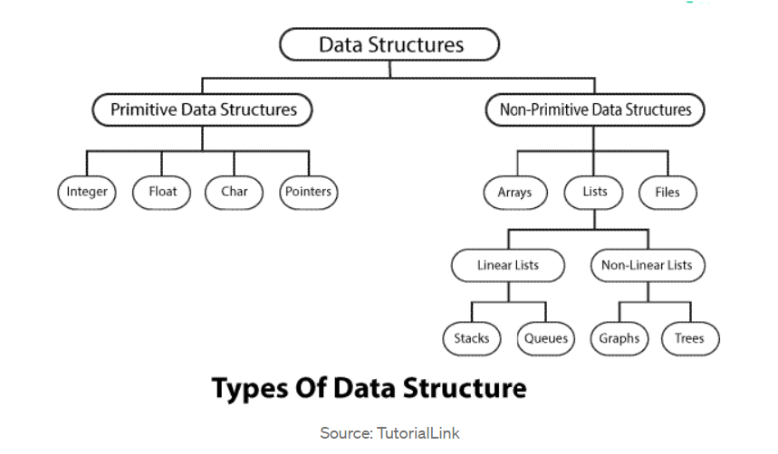

#  README

-----------

> [toc]

Ref.

##  Array

> fdss

Leetcode Problem Set

Notes

##  Binary

> dfs

Leetcode Problem Set

Notes

## Dynamic Programming

> fc

Leetcode Problem Set

Notes

## Graph

> fsd

Leetcode Problem Set

Notes

## Interval

> 34

Leetcode Problem Set

Notes

## Linked List

> sd

Leetcode Problem Set

Notes

## Matrix

> dsf

Leetcode Problem Set

Notes

## String

> fsdf

Leetcode Problem Set

Notes

## Tree

> sd

Leetcode Problem Set

Notes

## Heap

> sds

반영할 것들 1차 자료...

시작

> ㄹ
>
> ㄴ
>
> 1. Read
> 2. Visualize by drawing
> 3. Understand and Code
>
> 
>
> TIPS TO ACCELERATE YOUR JOURNEY IN DSA
>
> 1. Understand the fundamentals of the language that you are programming in. Learn beyond the theory by implementing all concepts in different ways.
> 2. Understand the depth of time and space complexity. Code and test.
> 3. Focus on strengthening logic instead of studying existing codes. A better logic will help you solve more unseen questions.
> 4. Improve problem-solving skills not only specific to programming. It changes the way you think and can help you gain more exposure to larger problems.
> 5. Practice coding on sites like [Leetcode](https://leetcode.com/), [GeeksForGeeks](https://www.geeksforgeeks.org/), [CodeChef](https://www.codechef.com/), [HackerRank](https://www.hackerrank.com/), [HackerEarth](https://www.hackerearth.com/), [CodeForces](https://codeforces.com/), etc. While practising, ensure that you solve at different difficulty levels. Do not stick to a particular level and solve all from that only. This will reduce your exposure to higher difficulty questions.
> 6. Keep calm and believe in yourself. No question is unsolvable.
>
> 
>
> 1. Binary Search
> 2. Search an element in a sorted and rotated array
> 3. Bubble Sort
> 4. Selection Sort
> 5. Insertion Sort
> 6. Merge Sort
> 7. Heap Sort (Binary Heap)
> 8. Quick Sort
> 9. Topological Sort
>
> 
>
> # ALGORITHMS YOU SHOULD KNOW AND MASTER
>
> - [DFS](http://www.btechsmartclass.com/data_structures/graph-traversal-dfs.html) and [BFS](http://www.btechsmartclass.com/data_structures/graph-traversal-bfs.html) Traversals
> - [Dijkstra’s Algorithm for Shortest Path](https://www.geeksforgeeks.org/dijkstras-shortest-path-algorithm-greedy-algo-7/)
> - [Prim’s](https://www.geeksforgeeks.org/prims-minimum-spanning-tree-mst-greedy-algo-5/) and [Kruskal’s](http://geeksforgeeks.org/kruskals-minimum-spanning-tree-algorithm-greedy-algo-2/) For Minimum Spanning Tree
> - [0–1 Knapsack Problem](https://www.tutorialspoint.com/design_and_analysis_of_algorithms/design_and_analysis_of_algorithms_01_knapsack.htm#:~:text=We have shown that Greedy,whole or should leave it.)
> - [Subset Sum Problem](https://www.geeksforgeeks.org/subset-sum-problem-dp-25/)
> - [Longest Common Subsequence](https://www.geeksforgeeks.org/longest-common-subsequence-dp-4/)
> - [Longest Increasing Subsequence](https://www.geeksforgeeks.org/longest-increasing-subsequence-dp-3/)
> - [Modular Exponentiation](https://www.geeksforgeeks.org/modular-exponentiation-power-in-modular-arithmetic/)
> - [Sum of Bit Differences among All Pairs](https://www.geeksforgeeks.org/sum-of-bit-differences-among-all-pairs/)
>
> 
>
> ㄴ
>
> ㄴ
>
> 

